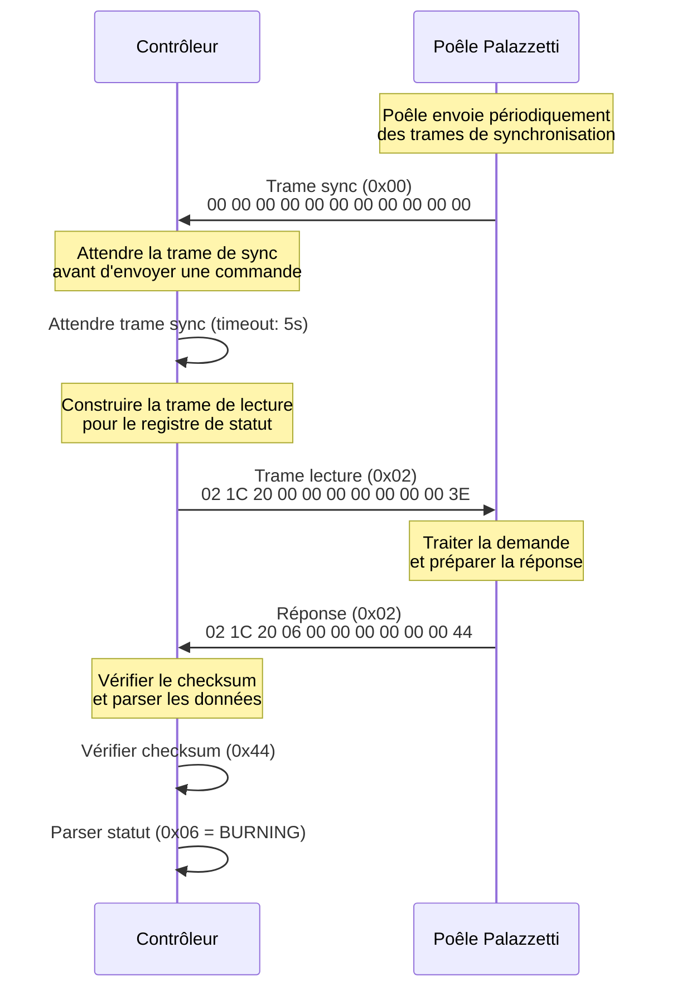
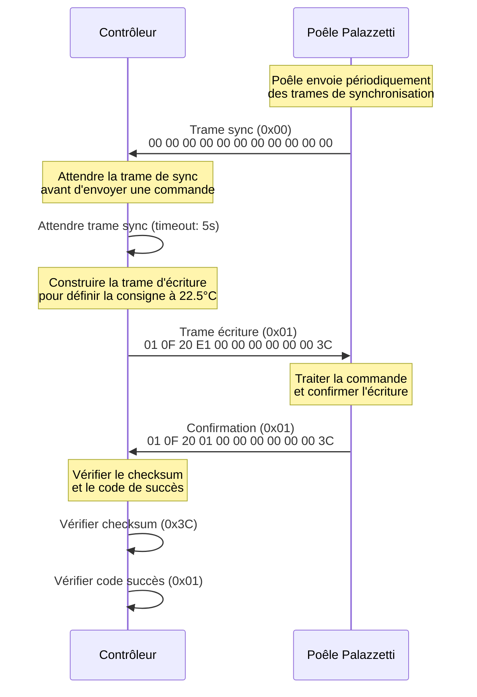
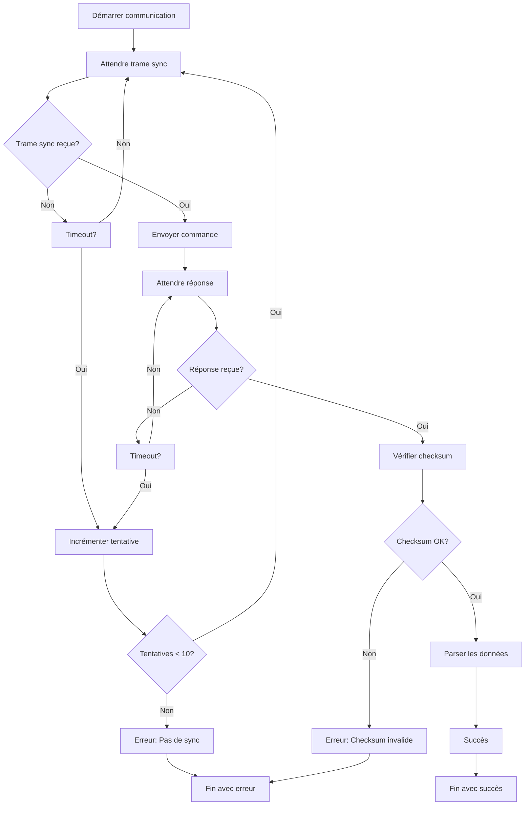
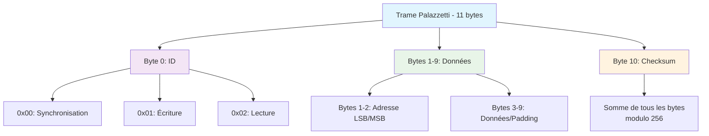
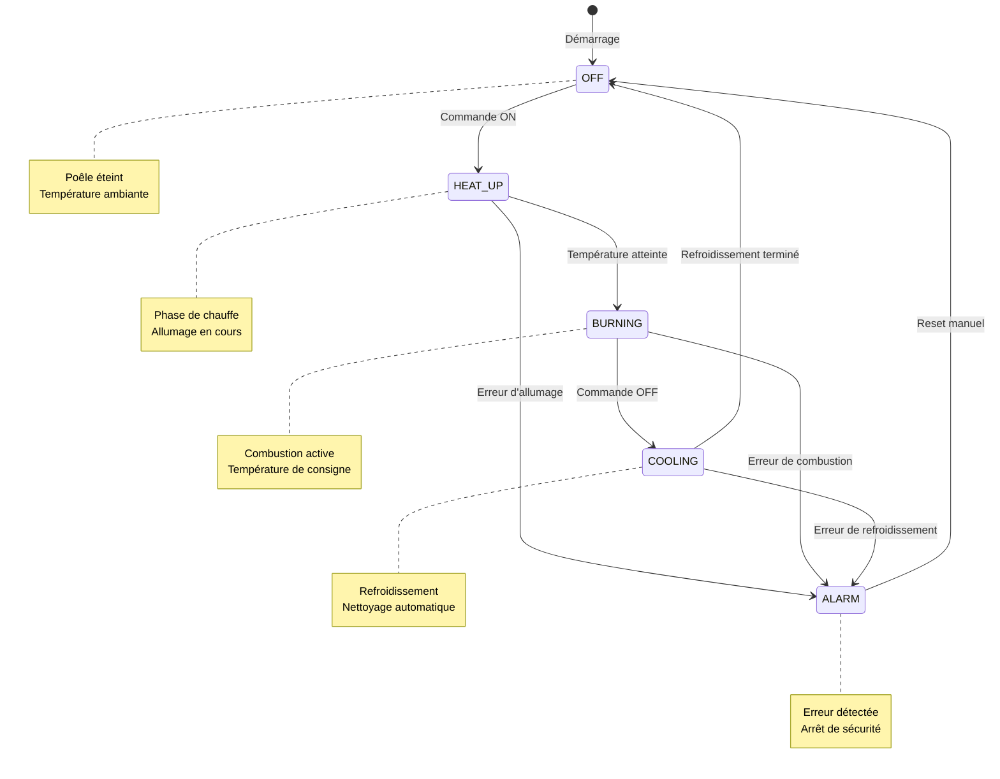
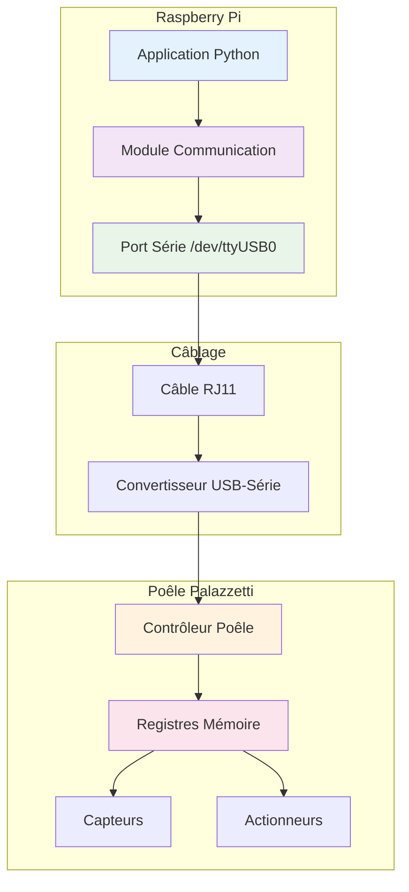
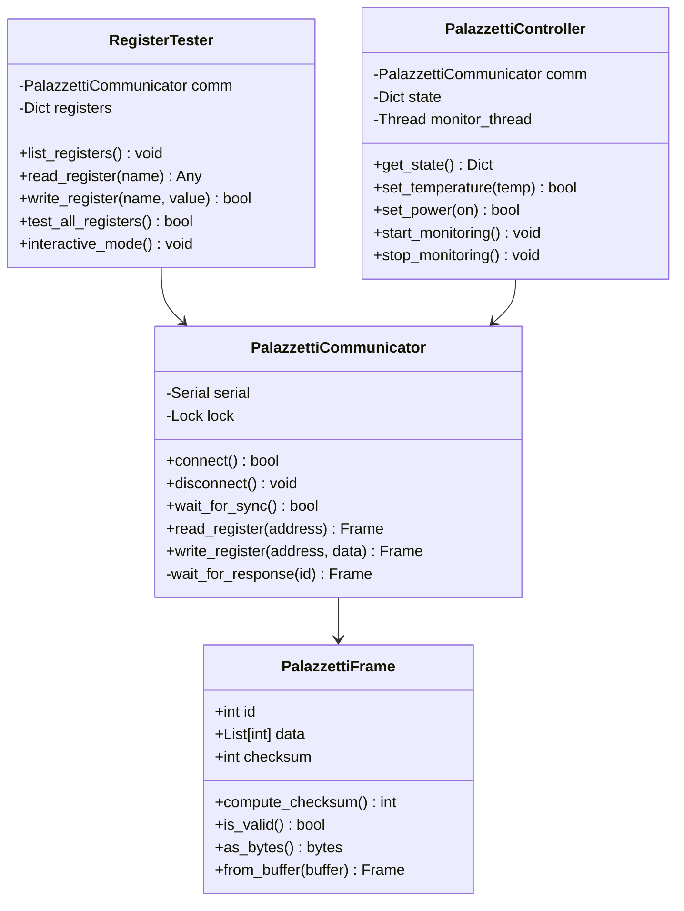
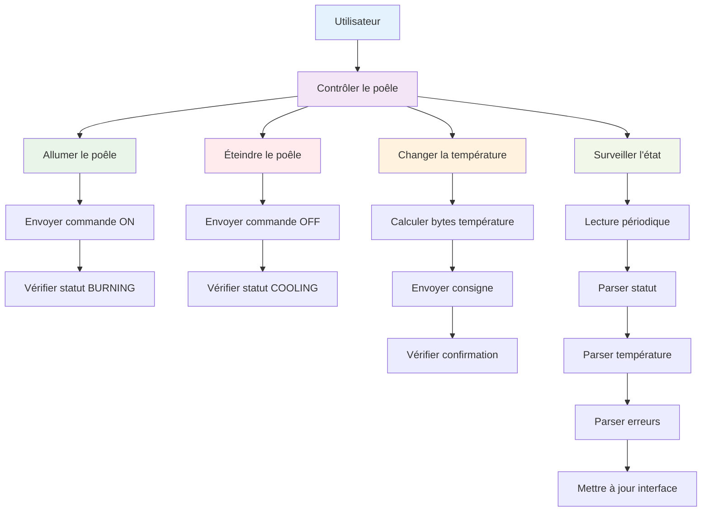

# Diagrammes du Protocole de Communication Palazzetti

## Diagramme de séquence - Lecture d'un registre



## Diagramme de séquence - Écriture dans un registre



## Diagramme de flux - Gestion des erreurs



## Diagramme de structure - Format des trames



## Diagramme d'état - Cycle de vie du poêle



## Diagramme de déploiement - Architecture système



## Diagramme de timing - Séquence de communication

```mermaid
gantt
    title Séquence de Communication Palazzetti
    dateFormat X
    axisFormat %L ms
    
    section Synchronisation
    Attendre sync    :0, 2000
    Trame sync reçue :2000, 2100
    
    section Lecture
    Envoyer lecture  :2100, 2200
    Traitement poêle :2200, 2500
    Réponse reçue    :2500, 2600
    
    section Écriture
    Envoyer écriture :2600, 2700
    Traitement poêle :2700, 3000
    Confirmation     :3000, 3100
    
    section Pause
    Attente          :3100, 5000
```



## Diagramme de classes - Structure du code



## Diagramme de flux de données - Parsing des registres

```mermaid
flowchart TD
    A[Trame reçue] --> B[Vérifier checksum]
    B --> C{Checksum valide?}
    C -->|Non| D[Erreur: Trame corrompue]
    C -->|Oui| E[Extraire ID et données]
    
    E --> F{Type de registre?}
    F -->|Statut| G[Parser statut<br/>data[2] = code]
    F -->|Température| H[Parser température<br/>data[2-3] = temp_raw/10]
    F -->|Consigne| I[Parser consigne<br/>data[2-3] = temp_raw/10]
    F -->|Puissance| J[Parser puissance<br/>data[2] = on/off]
    F -->|Erreur| K[Parser erreur<br/>data[2] = code]
    
    G --> L[Retourner (code, nom, alimenté)]
    H --> M[Retourner température °C]
    I --> N[Retourner consigne °C]
    J --> O[Retourner booléen]
    K --> P[Retourner code + message]
    
    D --> Q[Fin avec erreur]
    L --> R[Fin avec succès]
    M --> R
    N --> R
    O --> R
    P --> R
```

## Diagramme de cas d'usage - Scénarios typiques


